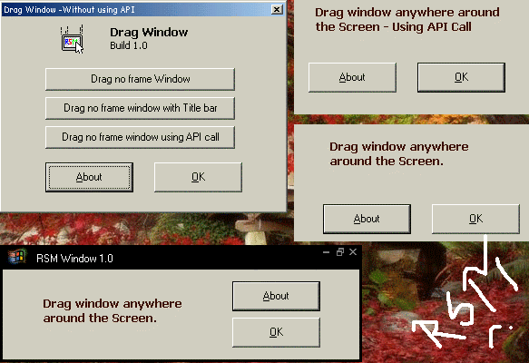



## Drag Window \- without using API

### Description

In this article, you can learn how to drag window having no title bar without using Windows API or other functions.

This article is useful to those of my fellow programmers who are tired of the ever to move no frame window on the screen. Well, here is something that might give u relief from that... something for a change!!! I had written this code sometime back and hope some of you will find some use for it.
 
### More Info
 

             |
---                |---
**Submitted On**   |2005-08-12 00:00:06
**By**             |[Mohit Soam](https://github.com/Planet-Source-Code/PSCIndex/blob/master/ByAuthor/mohit-soam.md)
**Level**          |Intermediate
**User Rating**    |4.0 (8 globes from 2 users)
**Compatibility**  |VB 6\.0
**Category**       |[Miscellaneous](https://github.com/Planet-Source-Code/PSCIndex/blob/master/ByCategory/miscellaneous__1-1.md)
**World**          |[Visual Basic](https://github.com/Planet-Source-Code/PSCIndex/blob/master/ByWorld/visual-basic.md)
**Archive File**   |[Drag\_Windo1923188112005\.zip](https://github.com/Planet-Source-Code/mohit-soam-drag-window-without-using-api__1-62159/archive/master.zip)

